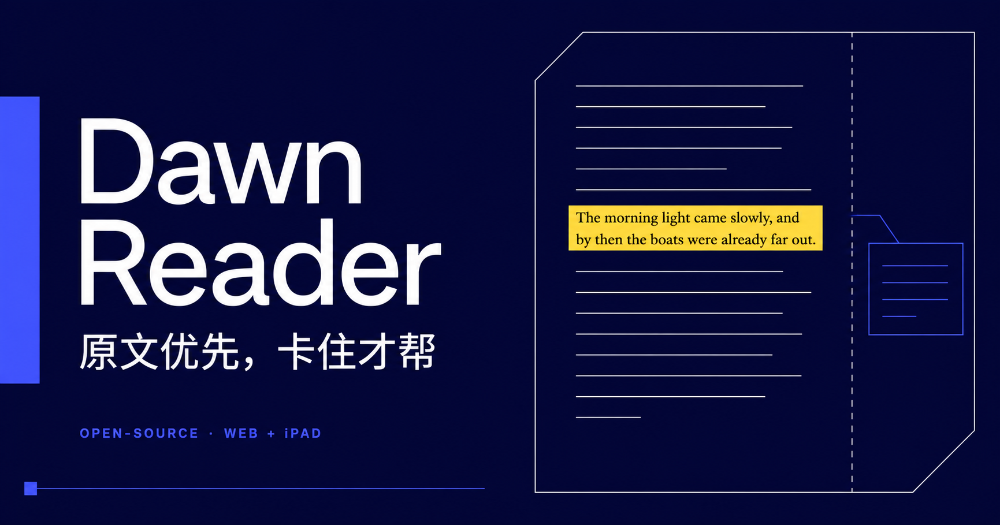

# Dawn Reader



> 不是把英文书改简单，而是让你有能力继续读下去。

[在线体验](https://dawn-reader-keeplearning.zhangboy.chatgpt.site) · [产品路线图](docs/product-roadmap.md) · [参与贡献](CONTRIBUTING.md)

Dawn Reader 是为中文母语者做的开源英文原著阅读器。原书始终是主角；只有在你真正卡住时，释义、拆句和上下文提示才会出现。

语言不是一串背下来的规则，它更像在真实语境里长出来的感觉。读得懂，才愿意继续；愿意继续，数量才会发生。词义、搭配和句式，便在一次次相遇中逐渐变得熟悉。

## 现在能做什么

- 在网页端和原生 iPad App 中阅读 EPUB；
- 点词、选句或用 Apple Pencil 圈出卡点，只请求当下需要的帮助；
- 用 LexTALE 做一次轻量校准，控制帮助的密度；
- 同步书架、阅读进度和阅读设置；
- 从书架安全删除电子书与进度，避免同步后重新出现；
- 没有 AI 密钥时使用明确标注的离线演示，不伪装成真实模型结果。

## 三条设计原则

1. **原文优先。** 不预先改写整章，不让双语对照淹没页面。
2. **卡住才帮。** 帮助应该缩短停顿，而不是制造新的学习任务。
3. **兴趣驱动数量。** 阅读器不规定你“应该”读什么，只帮助你留在真正想读的书里。

这些是产品假设，不是不可质疑的学习教条。它们受罗肖尼 Shawney 的[总述·阅读篇](https://www.bilibili.com/video/BV1aD4y127GE)、[听说篇](https://www.bilibili.com/video/BV1tf4y1s7NN)和[词汇篇](https://www.bilibili.com/video/BV1ns4y1A7fj)启发；这里的文字是项目自己的转述，视频内容及权利属于原作者。

## 本地运行

需要 Node.js 22+。仓库不包含电子书、API 密钥或视频文字稿。

```bash
git clone https://github.com/zhangboy03/dawn-reader.git
cd dawn-reader
npm install
cp .env.example .env
npm run dev
```

打开 <http://127.0.0.1:5173>。不配置 AI 也可以完成阅读闭环；如需上下文辅助，请在 `.env` 中配置 OpenAI-compatible 服务或使用本机 Ollama。

常用检查：

```bash
npm test
npm run build
npm audit --omit=dev
```

原生 iPad 工程位于 `ios/DawnReader`，依赖 Readium Swift Toolkit。详情见 [iOS 说明](ios/README.md)。

## 数据与隐私

- EPUB 默认保存在浏览器 IndexedDB 或 iPad App 的 Application Support；
- 在线同步使用 Cloudflare D1 与 R2，按已认证用户隔离；
- 导入的书不会进入 Git 仓库，也不会被提交给 AI；只有你主动选中的短文本会用于生成帮助；
- 删除已同步书籍时，客户端先确认云端删除成功，再清理本地副本；服务端保留删除标记，避免离线旧设备把书重新上传。

公开部署前请阅读 [安全政策](SECURITY.md)。不要在 Issue、日志或截图中上传受版权保护的图书、访问令牌或 API 密钥。

## 项目状态

Dawn Reader 目前是可用的 **v0.1**，还不是微信读书的完整替代品。P0 已覆盖阅读、书架、进度同步、设备配对和可靠删除；批注导出、全文检索、词典、OPDS、无障碍审计与冲突可视化仍在路线图中。

我们优先补完整闭环，而不是堆看起来聪明的按钮。欢迎提交可复现的问题、真实阅读场景和小而清楚的改进。

## 许可

代码以 [Apache License 2.0](LICENSE) 开源。仓库引用的第三方名称、视频与图书不包含在此许可中。
